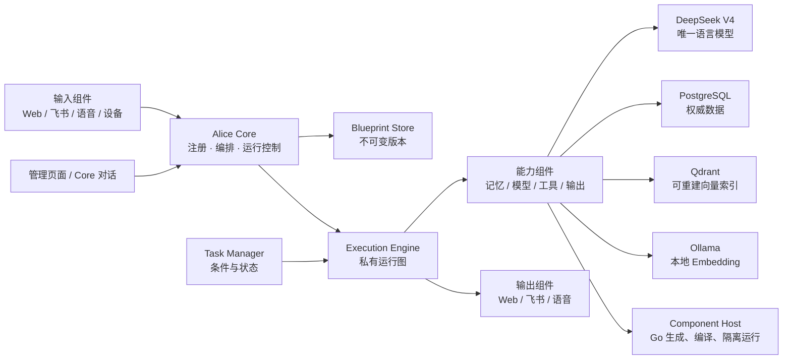

# Alice 架构与设计决策

状态：已确认的总体方向，部分能力尚未实现  
基线版本：Alice Core v0.2.1  
最后整理：2026-08-08

## 1. 产品定义

Alice 是一个面向家庭环境、但能力范围不限于家庭设备的通用个人 AI。系统中只有一个 Alice，不创建多个长期 Agent 实体，也不以传统 Session 隔离当前用户的上下文。

Alice Core 不是普通对话 Agent。它是 Alice 的稳定编排内核，负责组件注册、Blueprint 版本、Execution 生命周期、组件间数据传递、状态记录、运行控制和故障处理。真正的输入、输出、记忆、模型、工具、Task 和动态生成能力都尽量表现为组件。

当前所有输入默认属于同一个用户和同一条全局时间线。未来接入飞书、语音、手机或家庭设备时，由输入组件附带使用者身份；这不改变“只有一个 Alice”的产品定义。

## 2. 已确认的核心原则

### 2.1 能力组件化

- “接收网页输入”“接收飞书消息”“语音转文字”都是输入组件。
- “提取事实”“查询相关记忆”“调用 DeepSeek”“执行工具”“生成组件”都是处理组件。
- “输出到网页”“回复飞书”“语音播报”都是输出组件。
- Alice Core 只理解统一组件协议和数据 Envelope，不应为每一种渠道或业务写专用编排逻辑。
- 组件可以替换、版本化、激活和热添加；运行中的 Core 不因普通组件变化而重启。
- 只有修改 Alice Core 自身代码时才需要人工重启 Core。

### 2.2 没有额外的 Agent 实体

系统不引入“一个任务对应一个 Agent”“一个渠道对应一个 Agent”或“一个 Session 对应一个 Agent”的持久概念。

- Alice：面向用户的唯一智能主体。
- Alice Core：编排和运行控制内核。
- Component：可替换的能力。
- Blueprint：可版本化的流程定义。
- Execution：某一次真实运行。
- Task：满足条件后自动创建或触发 Execution 的管理对象。

### 2.3 用户不关心物理执行细节

Blueprint、组件实例、容器和进程是管理与调试手段，不应成为普通用户交互的必要知识。Alice 应直接理解目标并完成工作；管理页面主要服务开发、观察和高级控制。

## 3. 总体架构

## 4. Blueprint 与 Execution

### 4.1 Blueprint

Blueprint 是不可变、带版本号的有状态流程图。发布后的版本不原地修改；改变流程时发布新版本并选择是否激活。

默认情况下 Blueprint 必须是有限的有向无环图。理论上能完成的任务应在有限步内结束，不依赖无限循环。

如果未来某项任务确实必须循环，只允许使用显式的有界 Loop 组件，并且必须同时定义：

- 最大次数；
- 总超时和单次超时；
- 退出条件；
- Token、费用、工具调用或其他预算；
- 失败和人工接管条件。

### 4.2 Execution

启动运行时，Alice Core 从指定 Blueprint 版本复制一份私有图形成 Execution：

- Execution 中的临时修改不影响原 Blueprint。
- Core 可以在尚未执行的节点上替换组件、修改配置或跳过节点。
- 节点可以设置超时和最大重试次数。
- Execution 可以取消，节点输入输出、尝试次数、错误和事件都可以记录。
- 运行结束后，Alice 可以丢弃临时修改、发布为新的 Blueprint，或在明确选择后作为新激活版本使用。

“覆盖原流程”在版本化设计中应解释为“发布新版本并将活动指针切换到新版本”，而不是修改历史版本。

### 4.3 自主运行控制目标

目标状态下，Alice Core 应根据节点调用、返回数据、预算和运行状态，在合适时执行：调整、新增、临时修改、接管、重试、降级、暂停询问或结束。

当前版本只实现了运行控制原语和管理 API；完整的模型驱动自主控制器仍待实现。

## 5. Task 设计

Task 有独立的创建和管理边界，但 Task 的实际工作仍通过普通 Execution 完成。

### 5.1 语义

- 普通 Execution 由当前请求立即触发。
- Task 保存触发条件、目标 Blueprint、输入、状态、结果和关联 Execution。
- 条件满足后，Task Manager 创建或启动对应 Execution。
- Task 可以通过管理服务查询 waiting、running、completed、failed 等状态。
- Execution 完成后，将结果、状态、错误、时间和必要追踪数据交回 Task Manager。
- Task Manager 决定是否将结果落地为统一事实记忆；Task 自身的运行状态不是事实记忆。

### 5.2 目标触发器

除手动和指定时间外，未来触发器可以是 Cron、Webhook、外部事件、设备状态、事实变化或模型判断。触发器应是可替换组件，不进入 Alice Core 的硬编码业务逻辑。

## 6. 记忆与信息分类

聊天和运行过程中产生的信息不应全部混进一个“记忆”表。已确认的数据层次如下。

### 6.1 原始记录

原始记录保存最接近输入时的内容，用于追溯和重新计算，例如：

- 用户原始消息；
- Alice 原始回复；
- 将来接入的语音转录、附件元数据和渠道事件；
- 来源渠道、输入 ID、时间和回复句柄。

原始记录原则上不因后续总结或事实变化而被覆盖。

### 6.2 统一事实记忆

事实是可以独立陈述、未来可能有用，并且能够追踪来源的信息。例如：

- `user dislikes 香菜`；
- `净水器滤芯 last_replaced_at 2026-07-01`；
- `task:xxx completed_with_result 检查完成`。

不再区分“基本事实”和“用户基本事实”，也不单独建立“人、房间、设备关系”这一记忆大类。人物、房间、设备、偏好和关系都使用统一事实模型表达。不同业务需要时可通过 predicate、tag、时间和来源查询，而不是建立互相割裂的记忆系统。

事实至少需要以下语义字段：

- subject、predicate、object；
- asserted_by 和来源 ID；
- source_kind；
- confidence；
- valid_from、未来可扩展 valid_to；
- status 和版本关系；
- sensitivity；
- tags。

### 6.3 派生内容

派生内容不是新的权威原始记录，包括：

- 对话摘要；
- 事实候选；
- Embedding 向量；
- 搜索索引；
- 为某次模型调用组装的上下文。

派生内容必须能追溯来源。向量索引应可由 PostgreSQL 中的事实重建。

### 6.4 运行与审计数据

Blueprint、Execution、节点运行、Task 状态、组件版本、错误和事件时间线属于运行数据，不应强行作为长期事实记忆。运行结束后，可由管理组件或模型判断其中哪些结果值得转成事实。

### 6.5 事实提取与召回方式

“模型主动通过 Skill 查询数据库”和“每次输入自动召回相关记忆”不是互斥方案，它们都应作为组件存在：

- 默认对话 Blueprint 自动执行事实候选提取和相关事实召回，保证基础体验稳定。
- 对复杂任务，模型可以主动调用事实查询组件，改变查询词、过滤条件和数量。
- 是否提取、同步还是异步、冲突时替换还是并存、是否询问用户，目标上由模型结合上下文决定。
- 任何自动判断都应保留来源、决策和可审计记录。

当前版本已实现默认自动召回、对话后事实决策和基础冲突策略；主动工具式多轮查询仍待完整 Tool Calling 支持。

## 7. 存储与检索决策

### 7.1 PostgreSQL 是权威数据源

PostgreSQL 保存消息、事实、事实来源、设置、Blueprint、Task 和 Execution 快照。事实写入与 vector outbox 在同一事务内完成，避免 Qdrant 暂时失败时丢失事实。

### 7.2 Qdrant 是可重建索引

Qdrant 只保存事实向量及指向 PostgreSQL `fact_id` 的 payload，不作为事实真相来源。更换 Embedding 模型时，新建带模型指纹的 collection，重算完成后切换 alias。

### 7.3 本地 Ollama 只负责 Embedding

Ollama 在本地 Docker 中运行 `qwen3-embedding:0.6b`。它不参与聊天、事实判断、Core Operator 或组件生成。

### 7.4 混合召回

事实召回同时进行 PostgreSQL 文本检索和 Qdrant 语义检索，再用 RRF 融合排序，并回到 PostgreSQL读取完整事实。

## 8. 模型与缓存决策

### 8.1 只适配 DeepSeek

除本地 Ollama Embedding 外，Alice 只支持 DeepSeek 作为语言模型服务。以下能力必须进入同一个 DeepSeek Runtime：

- 普通对话；
- 事实提取、总结和冲突判断；
- Core Operator 的模型回答；
- Task Blueprint 中的语言模型节点；
- 动态 Go 组件生成和编译修复。

当前模型为 `deepseek-v4-flash` 或 `deepseek-v4-pro`，支持 thinking 开关和 high/max 推理强度。不得再增加隐藏的 OpenAI-compatible 对话 provider。

### 8.2 高缓存命中方向

Reasonix 带来的主要启发是把稳定信息放在前缀，把变化信息尽量放到后部，并让可复用中间结果拥有稳定身份。Alice 的目标缓存策略包括：

- 系统指令、组件协议、工具定义和 Blueprint 描述保持稳定顺序；
- JSON 和上下文序列化必须确定性输出，避免无意义顺序变化；
- 当前用户输入、时间和动态工具结果放在消息后部；
- Blueprint 计划、组件编译结果和 Embedding 使用内容指纹复用；
- 记录命中 token、未命中 token、延迟和费用，用数据决定是否优化；
- 不把推理内容作为普通长期记忆或下一轮无条件上下文。

当前版本使用 DeepSeek 自动磁盘上下文缓存，保持稳定系统提示，并统计 `prompt_cache_hit_tokens` 和 `prompt_cache_miss_tokens`。确定性 Prompt 编译器、Blueprint 计划缓存和组件输出缓存仍未实现。

## 9. 组件、工具与动态生成

### 9.1 组件协议

组件通过 Descriptor 声明 ID、版本、类型、生命周期、输入输出 Schema 和副作用，通过 Envelope 交换带 trace、input、execution 和 metadata 的数据。

组件运行模式可声明 singleton 或 per_call。目标上由 Alice 根据资源、并发、稳定性和成本选择运行方式，不要求普通用户配置物理实例。

### 9.2 动态 Go 组件

- Alice 主要使用 Go 开发，动态生成组件也优先生成 Go。
- 运行环境长期维护可用的 Go 编译工具链。
- Core 内置一个类似 Reasonix 的启动能力，用于生成组件 manifest 和 Go 源码。
- 编译由独立 Component Host 完成；编译错误回传模型，模型修改后重试。
- 成功组件立即注册并可激活，对新的 Execution 生效，不重启 Alice Core。
- Alice Core 之外的组件原则上都可由 Alice 管理、替换或重建。

### 9.3 Component 与 Tool 的关系

组件是 Alice 的统一能力边界，工具是模型可选择调用的一类组件。完整工具系统还需要：工具 Schema、发现、参数校验、DeepSeek tool_calls、多轮结果回传、副作用标记、幂等和未来的审批机制。

当前版本实现了组件调用和动态构建，但尚未实现完整 DeepSeek Tool Calling 循环。

## 10. 管理页面

管理页面应提供：

- Blueprint、Task、Execution、组件和事实查询；
- Alice Core 运行状态；
- 直接与 Core Operator 对话；
- DeepSeek 与 Embedding 状态；
- 未来的流程图、节点状态、事实管理、版本切换和运行接管。

管理页面服务开发与高级管理。普通用户不应为了完成日常任务而理解 Blueprint 或组件物理执行。

## 11. 权限与多用户

权限是重要设计问题，但已明确暂缓实现。当前管理页面只绑定本机地址，没有登录、角色、组件权限和敏感操作审批，不能视为已完成安全设计。

未来加入多渠道使用者信息后，需要重新设计：

- 用户和设备身份；
- 事实可见范围；
- 工具与组件权限；
- 敏感数据分级；
- 高风险副作用确认；
- 审计与撤销。

在权限系统完成前，不应把 Alice 直接暴露到公网或不可信局域网。

## 12. 运行数据与持续优化

理论上，输入、组件选择、节点数据、错误、重试、补丁、结果和成本都可以记录。记录的目的不是无限保存，而是让管理组件或模型判断：

- 是否需要优化 Blueprint；
- 是否应保存这次运行方式；
- 是否需要发布新组件或新版本；
- 哪些结果值得转成事实；
- 哪些记录应该过期、压缩或删除。

自动优化必须基于可回滚的版本发布，不能静默改写历史 Blueprint。

